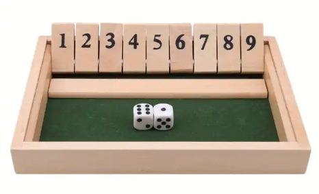

# Shut the Box Reinforcement Learning Agent

## Overview

This project implements a reinforcement learning agent to play the classic board game "Shut the Box." The agent learns to make optimal decisions by interacting with a custom environment built using OpenAI's Gymnasium library. The environment simulates the game mechanics, allowing the agent to roll dice, choose tiles to shut, and accumulate scores.


## Game Rules

In "Shut the Box," players roll two dice and attempt to shut numbered tiles (1 to 9) that sum up to the total rolled. Players can choose any combination of open tiles that add up to the dice sum. The goal is to shut as many tiles as possible, and the player with the lowest score at the end of the game wins.

## Installation

To run this project, you need to have Python 3.7 or higher installed. You can install the required packages using pip:

```bash
pip install numpy torch gymnasium stable-baselines3
```

## Usage

1. Clone the repository:

   ```bash
   git clone https://github.com/Ali-Noghabi/shot_the_box_rl.git
   cd shut-the-box-rl
   ```

2. Run the training script:

   ```bash
   python train_agent.py
   ```

   This will train the reinforcement learning agent for 500,000 steps using the Proximal Policy Optimization (PPO) algorithm.

3. The trained model will be saved as `ppo_shut_the_box.zip`.

## Environment

The custom environment is defined in `shut_the_box_environment.py`. It includes the following key methods:

- `reset()`: Resets the game state and rolls the dice.
- `roll_dice()`: Simulates rolling two dice and returns the sum.
- `step(action)`: Takes an action (shutting tiles) and returns the new state, reward, and whether the game is over.
- `get_valid_actions(dice_sum)`: Returns all valid combinations of tiles that can be shut based on the current dice sum.
- `render()`: Displays the current state of the game.

## Training the Agent

The agent is trained using the PPO algorithm from the Stable Baselines3 library. The training process involves the agent interacting with the environment, learning from its actions, and improving its strategy over time.

## Results

After training, the agent should be able to make decisions that maximize its score by effectively shutting tiles based on the rolled dice. You can further evaluate the agent's performance by implementing a testing script.

## Future Work

- Implement a testing script to evaluate the agent's performance against a baseline strategy.
- Experiment with different reinforcement learning algorithms and hyperparameters.
- Enhance the reward structure to encourage more strategic play.

## License

This project is licensed under the MIT License. See the [LICENSE](LICENSE) file for details.

## Acknowledgments

- [OpenAI Gym](https://gym.openai.com/) for providing the framework for building reinforcement learning environments.
- [Stable Baselines3](https://stable-baselines3.readthedocs.io/en/master/) for the implementation of reinforcement learning algorithms.

